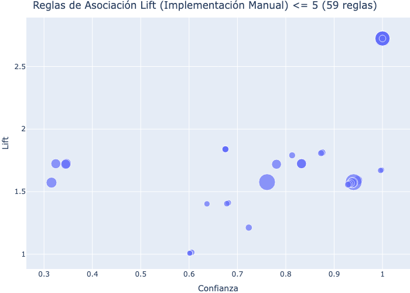
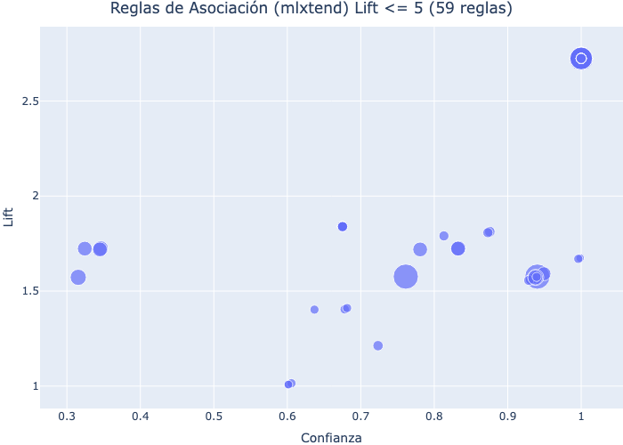

```{python}
import pandas as pd
from itertools import combinations
from typing import List, Set, Tuple, Dict
from mlxtend.frequent_patterns import apriori, association_rules
import plotly.express as px
import plotly.io as pio
import kaleido
import os

pio.renderers.default = 'iframe'
dataset = r'../datasets/data_secretariado.csv'

class Apriori:
    """
    Implementación del algoritmo Apriori con caché de cálculos.
    """

    def __init__(self, soporte_min: float = 0.5, confianza_min: float = 0.5):
        """
        Inicializa el algoritmo Apriori optimizado.

        Parámetros:
        -----------
        soporte_min : float
            Umbral de soporte mínimo (0.0 a 1.0). Default: 0.5
        confianza_min : float
            Umbral de confianza mínimo (0.0 a 1.0). Default: 0.5

        Regresa:
        --------
        None
        """
        self.soporte_min = soporte_min
        self.confianza_min = confianza_min
        self.transacciones = []
        self.itemsets_frecuentes = {}
        self.reglas_asociacion = []

        # Caché de soportes
        self.cache_soporte = {}

        # Indexar transacciones
        self.num_transacciones = 0

    def carga_transacciones(self, datos: pd.DataFrame, columnas: List[str] = None) -> None:
        """
        Carga transacciones desde un DataFrame de pandas.

        Parámetros:
        -----------
        datos : pd.DataFrame
            DataFrame con los datos de transacciones
        columnas : List[str], optional
            Columnas a utilizar. Si es None, usa todas menos la primera (ID).

        Regresa:
        --------
        None
        """
        if columnas is None:
            columnas = datos.columns[1:]

        self.transacciones = []
        for idx, fila in datos.iterrows():
            transaccion = []
            for columna in columnas:
                if pd.notna(fila[columna]) and fila[columna] != "":
                    transaccion.append(f"{columna}={fila[columna]}")
            if transaccion:
                self.transacciones.append(frozenset(transaccion))

        # Guardar número de transacciones
        self.num_transacciones = len(self.transacciones)

        # Convertir a conjunto de conjuntos para búsqueda más rápida
        self.transacciones_set = [set(t) for t in self.transacciones]

        print(f"✓ {self.num_transacciones} transacciones cargadas")

    def calcula_soporte(self, itemset: frozenset) -> float:
        """
        Calcula el soporte de un itemset (con caché).

        Parámetros:
        -----------
        itemset : frozenset
            Conjunto de items para el cual calcular el soporte

        Regresa:
        --------
        float
            Valor de soporte entre 0.0 y 1.0
        """
        # Verificar caché primero
        if itemset in self.cache_soporte:
            return self.cache_soporte[itemset]

        # Contar transacciones que contienen el itemset
        contador = sum(1 for transaccion in self.transacciones_set
                       if itemset.issubset(transaccion))
        soporte = contador / self.num_transacciones if self.num_transacciones > 0 else 0.0

        #Guardar en caché
        self.cache_soporte[itemset] = soporte

        return soporte

    def generar_candidatos(self, itemsets: List[frozenset], k: int) -> List[frozenset]:
        """
        Genera candidatos de forma más eficiente (F-k-join).

        Parámetros:
        -----------
        itemsets : List[frozenset]
            Lista de itemsets frecuentes del nivel anterior
        k : int
            Tamaño del itemset a generar

        Regresa:
        --------
        List[frozenset]
            Lista de candidatos generados
        """
        if k == 2:
            # Para k=2, simplemente hacer combinaciones de items
            items = set()
            for itemset in itemsets:
                items.update(itemset)
            items = sorted(list(items))
            candidatos = [frozenset([items[i], items[j]])
                         for i in range(len(items))
                         for j in range(i + 1, len(items))]
        else:
            # Para k>2, unir itemsets que comparten k-2 items
            candidatos = set()
            itemsets_sorted = sorted([sorted(list(x)) for x in itemsets])

            for i in range(len(itemsets_sorted)):
                for j in range(i + 1, len(itemsets_sorted)):
                    # Si comparten los primeros k-2 elementos
                    if itemsets_sorted[i][:-1] == itemsets_sorted[j][:-1]:
                        union = frozenset(itemsets_sorted[i]) | frozenset(itemsets_sorted[j])
                        if len(union) == k:
                            candidatos.add(union)

            candidatos = list(candidatos)

        return candidatos

    def obtiene_itemsets_frecuentes(self, itemsets: List[frozenset]) -> List[frozenset]:
        """
        Filtra itemsets por el umbral de soporte mínimo.

        Parámetros:
        -----------
        itemsets : List[frozenset]
            Lista de itemsets candidatos

        Regresa:
        --------
        List[frozenset]
            Lista de itemsets que cumplen con soporte_min
        """
        frecuentes = []
        for itemset in itemsets:
            if self.calcula_soporte(itemset) >= self.soporte_min:
                frecuentes.append(itemset)

        return frecuentes

    def apriori(self) -> Dict[int, List[Tuple[frozenset, float]]]:
        """
        Ejecuta el algoritmo Apriori completo (optimizado).

        Parámetros:
        -----------
        (ninguno)

        Regresa:
        --------
        Dict[int, List[Tuple[frozenset, float]]]
            Diccionario de itemsets frecuentes por nivel
        """
        if not self.transacciones:
            raise ValueError("No hay transacciones cargadas. Usa carga_transacciones() primero.")

        print(f"\n Ejecutando Apriori (soporte_min={self.soporte_min})...")

        self.itemsets_frecuentes = {}

        # Genera itemsets de tamaño 1
        print(" Generando itemsets de tamaño 1...")
        items = set()
        for transaccion in self.transacciones:
            items.update(transaccion)

        candidatos_1 = [frozenset([item]) for item in items]
        frecuentes_1 = self.obtiene_itemsets_frecuentes(candidatos_1)

        if not frecuentes_1:
            print(" ✗ No se encontraron itemsets frecuentes")
            return self.itemsets_frecuentes

        self.itemsets_frecuentes[1] = [(itemset, self.calcula_soporte(itemset))
                                        for itemset in frecuentes_1]

        print(f" ✓ {len(frecuentes_1)} itemsets de tamaño 1")

        # Genera itemsets de tamaño k > 1
        k = 2
        frecuentes_actuales = frecuentes_1

        while frecuentes_actuales:
            print(f" Generando itemsets de tamaño {k}...")

            candidatos_k = self.generar_candidatos(frecuentes_actuales, k)

            if not candidatos_k:
                break

            frecuentes_k = self.obtiene_itemsets_frecuentes(candidatos_k)

            if not frecuentes_k:
                print(f" ✓ {len(frecuentes_k)} itemsets de tamaño {k}")
                break

            self.itemsets_frecuentes[k] = [(itemset, self.calcula_soporte(itemset))
                                            for itemset in frecuentes_k]

            print(f" ✓ {len(frecuentes_k)} itemsets de tamaño {k}")

            frecuentes_actuales = frecuentes_k
            k += 1

        print(f"✓ Total de itemsets: {sum(len(v) for v in self.itemsets_frecuentes.values())}")

        return self.itemsets_frecuentes

    def calcula_confianza(self, antecedente: frozenset, consecuente: frozenset) -> float:
        """
        Calcula la confianza (con caché).

        Parámetros:
        -----------
        antecedente : frozenset
            Conjunto de items antecedentes
        consecuente : frozenset
            Conjunto de items consecuentes

        Regresa:
        --------
        float
            Valor de confianza entre 0.0 y 1.0
        """
        soporte_antecedente = self.calcula_soporte(antecedente)
        if soporte_antecedente == 0:
            return 0.0

        soporte_union = self.calcula_soporte(antecedente | consecuente)
        return soporte_union / soporte_antecedente

    def calcula_lift(self, antecedente: frozenset, consecuente: frozenset) -> float:
        """
        Calcula el lift (con caché).

        Parámetros:
        -----------
        antecedente : frozenset
            Conjunto de items antecedentes
        consecuente : frozenset
            Conjunto de items consecuentes

        Regresa:
        --------
        float
            Valor de lift
        """
        confianza = self.calcula_confianza(antecedente, consecuente)
        soporte_consecuente = self.calcula_soporte(consecuente)

        if soporte_consecuente == 0:
            return 0.0

        return confianza / soporte_consecuente

    def genera_reglas_asociacion(self) -> List[Dict]:
        """
        Genera reglas de asociación (optimizado).

        Parámetros:
        -----------
        (ninguno)

        Regresa:
        --------
        List[Dict]
            Lista de reglas de asociación
        """
        if not self.itemsets_frecuentes:
            raise ValueError("Primero debes ejecutar apriori()")

        print(f"\nGenerando reglas (confianza_min={self.confianza_min})...")

        self.reglas_asociacion = []
        contador_reglas = 0

        # Procesa itemsets de tamaño >= 2
        for k in sorted(self.itemsets_frecuentes.keys()):
            if k < 2:
                continue

            num_itemsets_k = len(self.itemsets_frecuentes[k])

            for idx, (itemset, soporte) in enumerate(self.itemsets_frecuentes[k]):
                if (idx + 1) % max(1, num_itemsets_k // 10) == 0:
                    print(f"  Procesando nivel {k}: {idx + 1}/{num_itemsets_k}")

                items = list(itemset)

                # Solo generar particiones, no todas las combinaciones
                for r in range(1, len(items)):
                    for items_antecedente in combinations(items, r):
                        antecedente = frozenset(items_antecedente)
                        consecuente = itemset - antecedente

                        confianza = self.calcula_confianza(antecedente, consecuente)

                        if confianza >= self.confianza_min:
                            lift = self.calcula_lift(antecedente, consecuente)

                            self.reglas_asociacion.append({
                                'antecedente': antecedente,
                                'consecuente': consecuente,
                                'soporte': soporte,
                                'confianza': confianza,
                                'lift': lift
                            })

                            contador_reglas += 1

        print(f"{contador_reglas} reglas generadas")

        return self.reglas_asociacion

    def obtiene_reglas_dataframe(self) -> pd.DataFrame:
        """
        Convierte las reglas generadas a un DataFrame de pandas.

        Parámetros:
        -----------
        (ninguno)

        Regresa:
        --------
        pd.DataFrame
            DataFrame con las reglas
        """
        if not self.reglas_asociacion:
            raise ValueError("Primero debes ejecutar genera_reglas_asociacion()")

        df = pd.DataFrame({
            'antecedente': [regla['antecedente'] for regla in self.reglas_asociacion],
            'consecuente': [regla['consecuente'] for regla in self.reglas_asociacion],
            'soporte': [regla['soporte'] for regla in self.reglas_asociacion],
            'confianza': [regla['confianza'] for regla in self.reglas_asociacion],
            'lift': [regla['lift'] for regla in self.reglas_asociacion]
        })

        return df.sort_values('lift', ascending=False).reset_index(drop=True)

    def obtiene_itemsets_frecuentes_dataframe(self) -> pd.DataFrame:
        """
        Convierte los itemsets frecuentes a un DataFrame de pandas.

        Parámetros:
        -----------
        (ninguno)

        Regresa:
        --------
        pd.DataFrame
            DataFrame con los itemsets
        """
        datos = []
        for k, lista_itemsets in sorted(self.itemsets_frecuentes.items()):
            for itemset, soporte in lista_itemsets:
                datos.append({
                    'itemset': itemset,
                    'soporte': soporte,
                    'tamaño': k
                })

        df = pd.DataFrame(datos)
        return df.sort_values('soporte', ascending=False).reset_index(drop=True)
```

## Limpieza del Dataset

- Convertimos los valores de fecha a formato datetime.
- Calculamos la edad de las víctimas y la agrupamos en categorías (discretización de información).
- Extraemos el mes y año de desaparición para análisis posteriores.
- Removemos columnas que no aportan información relevante para el análisis de reglas de asociación y clasificación.
- 133887 registros, 9 columnas de información a verificar.


```{python}
# Limpieza del dataset
datos = pd.read_csv(dataset)

# Convertir fechas a datetime
datos['FECHA_NACIMIENTO'] = pd.to_datetime(datos['FECHA_NACIMIENTO'], format='%Y-%m-%d', errors='coerce')
datos['FECHA_DESAPARICION'] = pd.to_datetime(datos['FECHA_DESAPARICION'], format='%Y-%m-%d %H:%M:%S', errors='coerce')
datos['FECHA_REGISTRO'] = pd.to_datetime(datos['FECHA_REGISTRO'], format='%Y-%m-%d %H:%M:%S', errors='coerce')

# Discretizar EDAD
datos['EDAD'] = (pd.Timestamp.now() - datos['FECHA_NACIMIENTO']).dt.days / 365.25
datos['GRUPO_EDAD'] = pd.cut(datos['EDAD'], bins=[0, 12, 18, 30, 50, 100],
                              labels=['0-12', '13-17', '18-30', '31-50', '50+'])

# Discretizar FECHA_DESAPARICION
datos['MES_DESAPARICION'] = datos['FECHA_DESAPARICION'].dt.month
datos['AÑO_DESAPARICION'] = datos['FECHA_DESAPARICION'].dt.year

# Remover columnas originales (ya tenemos discretizadas)
columnas_a_remover = [
    'ID_VICTIMA',
    'CVE_ENT',
    'CVE_MUN',
    'FECHA_NACIMIENTO',
    'FECHA_DESAPARICION',
    'FECHA_REGISTRO',
]

datos_limpio = datos.drop(columns=columnas_a_remover, errors='ignore')
datos_limpio = datos_limpio[~(datos_limpio == 'CONFIDENCIAL').all(axis=1)]
```
---

```python
datos['FECHA_NACIMIENTO'] = pd.to_datetime(datos['FECHA_NACIMIENTO'], format='%Y-%m-%d', errors='coerce')
datos['FECHA_DESAPARICION'] = pd.to_datetime(datos['FECHA_DESAPARICION'], format='%Y-%m-%d %H:%M:%S', errors='coerce')
datos['FECHA_REGISTRO'] = pd.to_datetime(datos['FECHA_REGISTRO'], format='%Y-%m-%d %H:%M:%S', errors='coerce')

datos['EDAD'] = (pd.Timestamp.now() - datos['FECHA_NACIMIENTO']).dt.days / 365.25
datos['GRUPO_EDAD'] = pd.cut(datos['EDAD'], bins=[0, 12, 18, 30, 50, 100],
                              labels=['0-12', '13-17', '18-30', '31-50', '50+'])

datos['MES_DESAPARICION'] = datos['FECHA_DESAPARICION'].dt.month
datos['AÑO_DESAPARICION'] = datos['FECHA_DESAPARICION'].dt.year

columnas_a_remover = [
    'ID_VICTIMA',
    'CVE_ENT',
    'CVE_MUN',
    'FECHA_NACIMIENTO',
    'FECHA_DESAPARICION',
    'FECHA_REGISTRO',
]
datos_limpio = datos.drop(columns=columnas_a_remover, errors='ignore')
datos_limpio = datos_limpio[~(datos_limpio == 'CONFIDENCIAL').all(axis=1)]
```

---

## Nuestra Implementación de Apriori

- Implementación como una clase de Python, usando frozensets, diccionarios como caché y algunos intentos de optimización.
- Añadimos funcionalidades para calcular soporte individual (para usar de paramétro en la creación de reglas) y generación
de reglas de asociación con confianza y lift.
- Tiempo de ejecución promedio de 3.5 minutos en cada ronda. (no alcanzamos los objetivos de optimización que queriamos.)
- 68 reglas de asosiación generadas con soporte mínimo de 0.05 y confianza mínima de 0.3.
- Necesaria discersión de reglas con lift menor a 5.

---

```python
apriori_manual = Apriori(soporte_min=0.05, confianza_min=0.3)
apriori_manual.carga_transacciones(datos_limpio, columnas=datos_limpio.columns)
itemsets_manual = apriori_manual.apriori()
reglas_asociación = apriori_manual.genera_reglas_asociacion()
df_reglas_manual = apriori_manual.obtiene_reglas_dataframe()
# Guardamos el csv para post-procesamiento.
df_reglas_manual.to_csv('../datasets/datos_apriori_manual.csv', encoding='utf-8')
```

---

```{python}
df_apriori_manual = pd.read_csv('../datasets/datos_apriori_manual.csv')
df_apriori_manual['antecedente'] = df_apriori_manual['antecedente'].str.extract(r"{(?:'|\")(.*)(?:'|\")}")
df_apriori_manual['consecuente'] = df_apriori_manual['consecuente'].str.extract(r"{(?:'|\")(.*)(?:'|\")}")
df_filtrado_manual = df_apriori_manual[df_apriori_manual['lift'] < 5]
```



---
```{python}
df_manual_final = df_filtrado_manual[['antecedente', 'consecuente', 'soporte', 'confianza', 'lift']]
df_manual_final.to_csv('../datasets/datos_manual_final.csv', encoding='utf-8')
df_manual_final.head(15)
```

---

## Usando mlxtend

- Mismos parámetros de confianza mínima y soporte mínimo (0.3 y 0.5 respectivamente).
- Tiempo de ejecución promedio de 35 segundos en cada ronda. (no alcanzamos los objetivos de optimización que queriamos.)
- 68 reglas de asosiación generadas, mismas que con nuestra implementación del algoritmo, pero en distinto orden.
- Necesaria discersión de reglas con lift menor a 5.

---

```{python}
# Para trabajar con algo que entienda el apriori de mlxtend, se debe convertir a un dataframe booleano/onehot.
# Esto es, convertir cada valor en una columna booleana.

datos_para_mlxtend = datos_limpio.copy()

# En lugar de insertar columna por columna, crear una lista de columnas
columnas_onehot = {}

for columna in datos_para_mlxtend.columns:
    valores_unicos = datos_para_mlxtend[columna].dropna().unique()

    for valor in valores_unicos:
        nombre_col = f"{columna}={valor}"
        columnas_onehot[nombre_col] = (datos_para_mlxtend[columna] == valor).astype(bool)

datos_onehot = pd.DataFrame(columnas_onehot)

itemsets_frequentes_mlxtend = apriori(datos_onehot, min_support=0.05, use_colnames=True)
reglas_mlxtend = association_rules(itemsets_frequentes_mlxtend, metric='confidence', min_threshold=0.3)
reglas_mlxtend = reglas_mlxtend[['antecedents', 'consequents', 'support', 'confidence', 'lift']]
reglas_mlxtend.to_csv('../datasets/datos_mlxtend.csv', encoding='utf-8')
```

```python
# Para trabajar con algo que entienda el apriori de mlxtend, se debe convertir a un dataframe booleano/onehot.
# Esto es, convertir cada valor en una columna booleana.
datos_para_mlxtend = datos_limpio.copy()

# En lugar de insertar columna por columna, crear una lista de columnas
columnas_onehot = {}
for columna in datos_para_mlxtend.columns:
    valores_unicos = datos_para_mlxtend[columna].dropna().unique()

    for valor in valores_unicos:
        nombre_col = f"{columna}={valor}"
        columnas_onehot[nombre_col] = (datos_para_mlxtend[columna] == valor).astype(bool)

datos_onehot = pd.DataFrame(columnas_onehot)
itemsets_frequentes_mlxtend = apriori(datos_onehot, min_support=0.05, use_colnames=True)
reglas_mlxtend = association_rules(itemsets_frequentes_mlxtend, metric='confidence', min_threshold=0.3)
reglas_mlxtend = reglas_mlxtend[['antecedents', 'consequents', 'support', 'confidence', 'lift']]
# Guardamos el csv para post-procesamiento.
reglas_mlxtend.to_csv('../datasets/datos_mlxtend.csv', encoding='utf-8')
```

---

```{python}
df_mlxtend = pd.read_csv('../datasets/datos_mlxtend.csv')

df_mlxtend['antecedents'] = df_mlxtend['antecedents'].str.extract(r"{(?:'|\")(.*)(?:'|\")}")
df_mlxtend['consequents'] = df_mlxtend['consequents'].str.extract(r"{(?:'|\")(.*)(?:'|\")}")
df_filtrado_mlxtend = df_mlxtend[df_mlxtend['lift'] < 5]
```



---

```{python}
df_mlxtend_final = df_filtrado_mlxtend[['antecedents', 'consequents', 'support', 'confidence', 'lift']]
df_mlxtend_final.to_csv('../datasets/datos_mlxtend_final.csv', encoding='utf-8')
df_mlxtend_final.head(15)
```

---

## Rangos de edad

- Rango de edad promedio de las víctimas desaparecidas es entre 31 y 50 años.
- Rango de edad de 18-30 tiene una confianza más alta, podría indicar que aunque son menos casos en este rango,
es más probable que si sean reportados.

| ID | Antecedente | Consecuente | Soporte | Confianza | Lift |
|---:|---|---|---:|---:|---:|
| 24 | `GRUPO_EDAD=50+` | `ESTATUS_VICTIMA=DESAPARECIDA` | 0.0840 | 0.9314 | 1.5611 |
| 25 | `GRUPO_EDAD=31-50` | `ESTATUS_VICTIMA=DESAPARECIDA` | 0.1881 | 0.3154 | 1.5723 |
| 26 | `ESTATUS_VICTIMA=DESAPARECIDA` | `GRUPO_EDAD=31-50` | 0.1882 | 0.3154 | 1.5723 |
| 27 | `GRUPO_EDAD=18-30` | `ESTATUS_VICTIMA=DESAPARECIDA` | 0.0874 | 0.9348 | 0.9348 |

---

## Perfil Demográfico

- Conforme aumenta la edad, se observa una mayor sobrerrepresentación de hombres en el registro.
- lifts crecientes ($<1$) por grupo sugieren un sesgo de reporte/captura por edad y sexo.

| ID | Antecedente | Consecuente | Soporte | Confianza | Lift |
|---:|---|---|---:|---:|---:|
| 14 | `GRUPO_EDAD=50+` | `SEXO=HOMBRE` | 0.0790 | 0.8756 | 1.813 |
| 15 | `GRUPO_EDAD=31-50` | `SEXO=HOMBRE` | 0.1671 | 0.8330 | 1.725 |
| 17 | `GRUPO_EDAD=18-30` | `SEXO=HOMBRE` | 0.0634 | 0.6781 | 1.404 |
| 53 | `SEXO=HOMBRE, ESTATUS_VICTIMA=DESAPARECIDA` | `GRUPO_EDAD=31-50` | 0.1567 | 0.3449 | 1.719 |

---

## Confidencialidad en Bloque

- Patrón sistémico: cuando un campo es confidencial, los demás también lo son (36.71% de los casos).
- Existe un mecanismo de censura sistémico de la información.
- Políticas de privacidad (sin explicar cuales son), temor a represalias, o falta de información capturada

| ID | Antecedente | Consecuente | Support | Conf. | Lift |
|---:|---|---|---:|---:|---:|
| 7  | `ESTATUS_VICTIMA=CONFIDENCIAL` | `SEXO=CONFIDENCIAL` | 0.3671 | 1.0000 | 2.724 |
| 10 | `SEXO=CONFIDENCIAL` | `MUNICIPIO=CONFIDENCIAL` | 0.3671 | 1.0000 | 2.724 |
| 20 | `ESTATUS_VICTIMA=CONFIDENCIAL` | `MUNICIPIO=CONFIDENCIAL` | 0.3671 | 1.0000 | 2.724 |

---

## Sesgo por entidad — caso Jalisco

- Si el registro de desaparición se hace en Jalisco, es muy probable que el resto de los campos
terminen siendo confidenciales.
- Impide cualquier análisis de perfil o tendencia en esta entidad.

| ID | Antecedente | Consecuente | Soporte | Confianza | Lift |
|---:|---|---|---:|---:|---:|
| 9  | `ENTIDAD=JALISCO` | `SEXO=CONFIDENCIAL` | 0.0747 | 0.6752 | 1.839 |
| 19 | `ENTIDAD=JALISCO` | `ESTATUS_VICTIMA=CONFIDENCIAL` | 0.0747 | 0.6752 | 1.839 |
| 30 | `ENTIDAD=JALISCO` | `MUNICIPIO=CONFIDENCIAL` | 0.0747 | 0.6752 | 1.839 |
| 36 | `ESTATUS_VICTIMA=CONFIDENCIAL, ENTIDAD=JALISCO` | `SEXO=CONFIDENCIAL` | 0.0747 | 1.0000 | 2.724 |
| 45 | `ENTIDAD=JALISCO, SEXO=CONFIDENCIAL` | `MUNICIPIO=CONFIDENCIAL` | 0.0747 | 1.0000 | 2.724 |
| 46 | `ENTIDAD=JALISCO, MUNICIPIO=CONFIDENCIAL` | `SEXO=CONFIDENCIAL` | 0.0747 | 1.0000 | 2.724 |

---

## Sesgo Temporal

- Registros de 2024 en adelante tienen un rezago de actualización.
- Procesos de investigación y actualización de casos lento o inexistente.
- Impide análisis de tendencias recientes o impacto de políticas públicas.

| ID | Antecedente | Consecuente | Soporte | Confianza | Lift |
|---:|---|---|---:|---:|---:|
| 28 | `AÑO_DESAPARICION=2025.0` | `ESTATUS_VICTIMA=DESAPARECIDA` | 0.0512 | 0.9985 | 1.674 |
| 29 | `AÑO_DESAPARICION=2024.0` | `ESTATUS_VICTIMA=DESAPARECIDA` | 0.0598 | 0.9960 | 1.669 |
